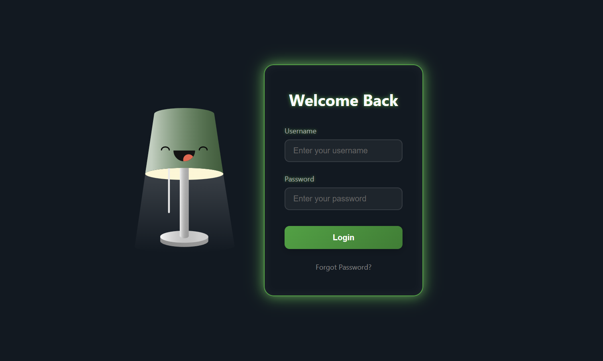

# 💡 Cute Lamp Login Form

An interactive and playful login form concept where users need to "pull" a lamp cord to reveal the login inputs. Built with HTML, CSS, and GSAP animations.

### 🔴 [Live Demo](https://arunkumarcpv007-tech.github.io/cute-lamp-login/)



## ✨ Features

- **Interactive Animation:** Draggable lamp cord using GSAP.
- **Dynamic Lighting:** The screen theme changes when the lamp is turned "On".
- **Playful UI:** The lamp character reacts to the light state (eyes open/close).
- **Responsive Design:** Works smoothly on desktop and accessible on mobile.

## 🛠️ Technologies Used

- **HTML5** - Structure
- **CSS3** - Styling & Variables
- **JavaScript** - Logic
- **GSAP (GreenSock)** - For Draggable and MorphSVG animations

## 🚀 How to Run Locally

1. Clone the repository:
   ```bash
   git clone [https://github.com/arunkumarcpv007-tech/cute-lamp-login.git](https://github.com/arunkumarcpv007-tech/cute-lamp-login.git)
Navigate to the folder:

Bash

cd cute-lamp-login
Open index.html in your browser.

🤝 Credits
Inspired by interactive web design concepts found on CodePen.

Created with ❤️ by Arunkumar
